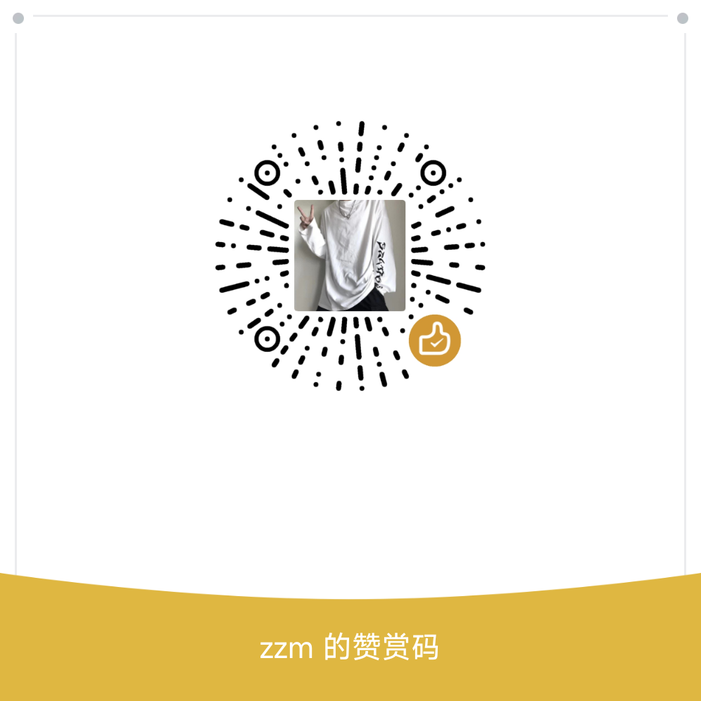

<div align="center">

  <h1>Stardew Valley Switch Native Mod</h1>

  <p>Native Automate Lite, Skull Cavern Elevator, and four-ring expansion for Stardew Valley on Nintendo Switch.</p>

[](https://www.nintendo.com/switch/)
[](https://www.stardewvalley.net/)
[](https://github.com/Atmosphere-NX/Atmosphere)
[](https://developer.arm.com/architectures/cpu-architecture/a-profile)
[](https://github.com/zmzhang2022-ai/Switch-StardewValley-Mod/stargazers)
[](https://github.com/zmzhang2022-ai/Switch-StardewValley-Mod/commits/main/)
[](./assets/wechat-reward-code.png)

<p><a href="./README.md">中文</a>&nbsp;&nbsp;&nbsp;&nbsp;<a href="./README_EN.md">English</a></p>

</div>

Copyright (C) 2026 `zmzhang2022-ai`. Licensed under [GPL-2.0-only](./LICENSE).
Official repository: <https://github.com/zmzhang2022-ai/Switch-StardewValley-Mod>

## About

This is a native mod for the Nintendo Switch version of Stardew Valley. It does
not port SMAPI or run PC mod DLLs. Instead, it uses Atmosphère runtime injection,
ARM64 hooks, and native C++ to implement Automate Lite, a Skull Cavern Elevator,
and four ring slots.

Target build:

```text
Game version: Stardew Valley 1.6.15.3
Title ID: 0100E65002BB8000
Game Build ID: A5C617C14A7F3F6620B3BC8136965A4822D32B9C
```

All offsets, virtual-function slots, and ABI findings apply only to this Build
ID. They must be re-analyzed after a game update.

## Core Features

| Feature | Description |
| --- | --- |
| Automate Lite | Automatic machine input/output using original game item and machine lifecycle logic |
| Network routing | Chests, machines, Fish Ponds, and Wood Paths connect through four-directional flood fill |
| Full-map coverage | Loaded root maps and instantiated interiors, including Farmhouses and Cabins |
| Performance scheduler | Current map every 30 ticks; one background map polled every 4 ticks |
| Skull Cavern Elevator | Five-floor stops, floors beyond 120, native scrollable menu, and elevator icon |
| Four ring slots | Original two slots plus two additional slots using Layout 2 |
| Fish Pond output | Generated roe and other products move into connected chests |

## Supported Machines

<div align="center">

| Machine | Auto-input | Auto-output |
| --- | :---: | :---: |
| Cheese Press | Yes | Yes |
| Recycling Machine | Yes | Yes |
| Solar Panel | — | Yes |
| Statue of Perfection | — | Yes |
| Crystalarium | Yes | Yes |
| Keg | Yes | Yes |
| Statue of Endless Fortune | — | Yes |
| Cask | Yes | Yes |
| Tapper | — | Yes |
| Dehydrator | Yes | Yes |
| Fish Smoker | Yes | Yes |
| Furnace | Yes | Yes |
| Statue of True Perfection | — | Yes |
| Seed Maker | Yes | Yes |
| Mayonnaise Machine | Yes | Yes |
| Lightning Rod | — | Yes |
| Heavy Tapper | — | Yes |
| Heavy Furnace | Yes | Yes |
| Preserves Jar `(BC)15` | Yes | Yes |
| Geode Crusher `(BC)182` | Yes | Yes |

</div>

The Preserves Jar and Geode Crusher have passed source, ELF, AArch64, and NSO
static verification. Continuous input/output and full-chest protection still
require end-to-end testing on real Switch hardware.

## Automate Network

Supported layouts:

```text
[Chest]—[Machine]
[Chest]—[Wood Path]—[Machine]
[Chest]—[Machine]—[Machine]
[Chest]—[Wood Path]—[Machine]—[Machine]
```

- Same-tile and four-directional connections are used; diagonals are not.
- One network may contain multiple chests and machines.
- Finished products are collected before the next input cycle.
- Full chests do not clear machine output; the product remains in the machine.
- Original `Chest.AddItem(...)`, `Object.AttemptAutoLoad(...)`, and machine output
  lifecycle are used instead of directly writing timers or inventory stacks.

## Wood Paths and Fish Ponds

Wood Paths with item ID `405` / `(O)405` act as network connectors. Each path
tile is indexed as a node after the original network-field unwrap flow and
`Flooring.GetData()` validation.

Fish Ponds are output-only Automate machines. Their complete TileArea is indexed,
generated roe and other products are moved to connected chests, and products are
kept in the pond when all chests are full. Fish and quest items are not inserted
automatically.

## Installation

Copy the repository's `atmosphere` directory to the root of the SD card:

```text
atmosphere/
└─ contents/
   └─ 0100E65002BB8000/
      └─ exefs/
         ├─ main.npdm
         └─ subsdk9
```

The original `exefs/main` is not permanently modified. `subsdk9` performs the
runtime injection and `main.npdm` supplies the required SVC permissions.

### Copyright and Provenance

- Original Mod code is licensed under [GPL-2.0-only](./LICENSE).
- `subsdk9` contains embedded `AutomateLite v9`, copyright, and official repository identifiers.
- Version-specific Build ID: `A5C617C14A7F3F6620B3BC8136965A4822D32B9C`.
- The public repository does not include the original game `main` or other game-distribution files.
- The provenance patch preserves the NSO file size, module ID, and load segments.

## User Notice

> [!WARNING]
> This project is version-specific. Do not reuse offsets or the deployment files
> with another game Build ID. Always keep a backup of your save before testing.

> [!CAUTION]
> This is a personal research and mod-development project for legally owned game
> copies. It does not provide DRM circumvention, key extraction, or game files.
> The user is responsible for testing and for any save or mod-file risks.

## Support This Project

Thank you to everyone who supports and donates to this project.

If you do not currently have a stable income or are experiencing financial
hardship, please do not donate. Please take care of yourself and your family
first. Your understanding and use of this project are the greatest support you
can give.

<p align="center">
  
</p>

## Feedback

Please use [GitHub Issues](https://github.com/zmzhang2022-ai/Switch-StardewValley-Mod/issues)
for bug reports and feature requests. Include the game Build ID, Atmosphère
version, reproduction steps, relevant logs, and whether the issue is reproducible.

## License and Scope

The repository contains the Mod overlay and documentation only. It does not
redistribute the original game executable or other copyrighted game assets.
