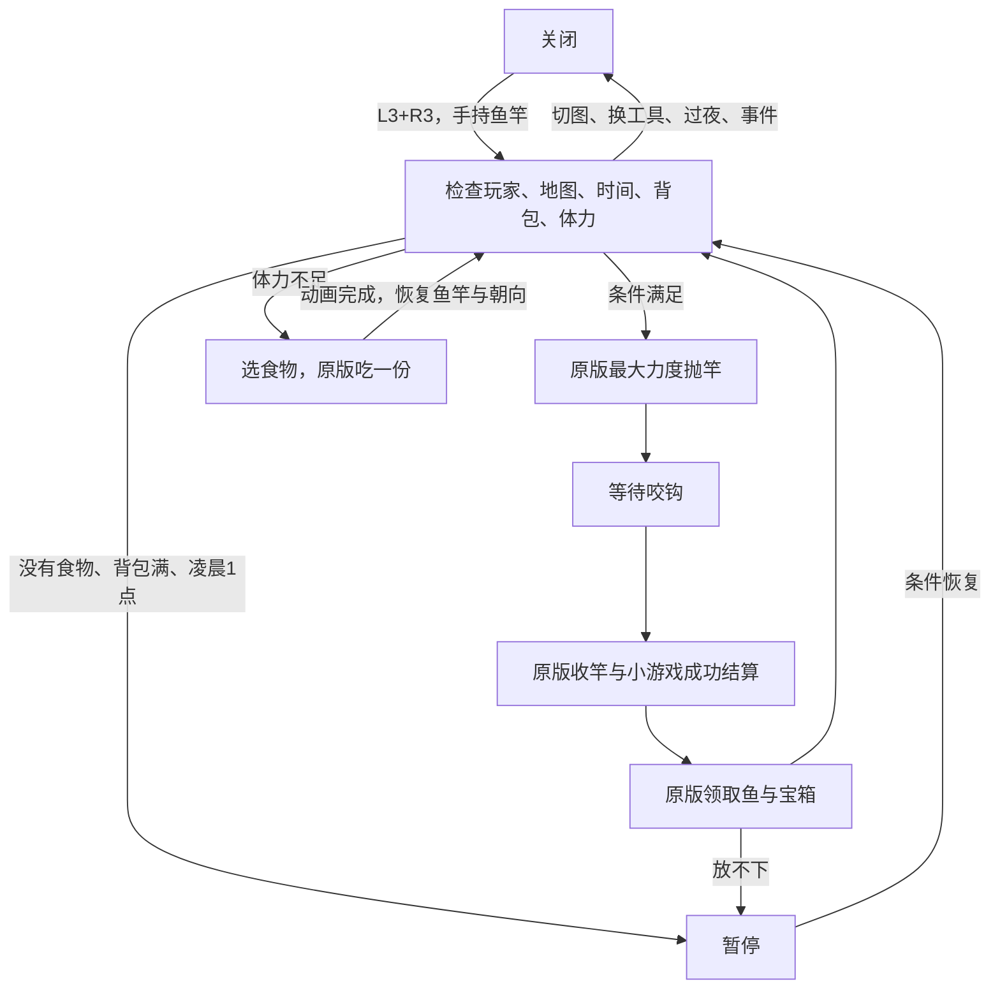

# 自动钓鱼 v12.1：完整设计与实现记录

## 2026-09-16 两项修复

用户反馈 v12 抛竿距离不足、钓不到高品质鱼，其余功能完好。这是用户整体反馈，未推断未提到的边界用例已验收。

- v12.1 在实际 `doStartCasting` 入口 `0x1A95E80` 设置 castingPower=1。原版随后清除 isTimingCast，Tick 才消费该力度计算落点；不再只依赖工具键调用之后的早期写入。
- 自动钓鱼时将 BobberBar.fishQuality（+0xD0）设置为4（铱星）。原版 Perfect 只将银星升金星、金星及以上升铱星，普通0不会升级。新的值经过原版收鱼流程仍为4。
- 只影响本地自动钓鱼开启时的鱼竿和小游戏鱼；垃圾/海藻、宝箱物品不强制改变品质，关闭后手动钓鱼保留原规则。
- 新增1个抛竿入口 Hook；整个模块保守预算31/40，余9槽。与v12相比仅修改 fishing.cpp、signatures.hpp 和版本标识。
- v12.1 静态测试、ARM64构建和NSO三段校验通过；品质分支已用精确原版 ARM64 指令做隔离模拟测试。**两项修复的真机复测未执行。**
- 安装包：`deploy/auto-fishing-singleplayer-merged-v12-1.zip`。旧v12包、源码和ELF保留作对照。

日期：2026-09-15。目标：Switch Stardew Valley 1.6.15.3，单人模式。
基线：v11.1 整合包。保留 Automate、电梯、四戒指和 UI Info Suite 2。
**这是本地实现候选，真机启动、钓鱼和进食验证均未执行。**

## 使用

1. 手持鱼竿，站在水边，面向可钓水面。
2. 同时按下左右摇杆（L3+R3），开启全自动循环。两键均松开后再按可关闭。
3. 自动最大力度抛竿、等待原版咬钩、收竿、跳过小游戏操作、领取鱼和本次出现的宝箱，再抛下一竿。
4. 体力低于 10 时，从背包自动选择恢复体力的食物。吃完自动切回鱼竿、恢复原朝向并继续。
5. 背包满、没有食物或临近凌晨时暂停。关闭菜单、腾出空间、放入食物后会重新检查条件。

没有游戏内设置菜单，没有补充鱼饵/浮标功能，也不凭空生成消耗品。
开关不写存档；重新读档、过夜、切图、切换工具、进入事件后需要重新开启。

## 已确认需求与明确默认值

| 项目 | 行为 |
|---|---|
| 主开关 | L3+R3 切换，长按不连发；重新触发前须两键均释放 |
| 自动范围 | 抛竿 → 等咬钩 → 收竿 → 完美成功 → 领取 → 下一竿 |
| 小游戏 | 不需要控条；保留原版成功、声音清理、收鱼和淡出动画，可能短暂显示窗口 |
| 完美 | 原版 Perfect 标志；小游戏鱼设为铱星，经验和收藏记录仍走原版结算 |
| 宝箱 | 本次原版出现的普通/金色宝箱必定取得；不提高宝箱出现率 |
| 鱼种、垃圾、数量 | 原版生成，包括鱼饵影响；不会把垃圾变成鱼或人为增加条数 |
| 咬钩速度 | 保留原版等待时间 |
| 抛竿力度/方向 | 最大力度、当前朝向，不自动走路寻找水面 |
| 体力 | 低于 10 点暂停抛竿并尝试进食；保留原版钓鱼消耗与技能/附魔效果 |
| 食物范围 | 用户授权背包任意可恢复体力的食物；鱼、料理等都可能被吃掉 |
| 选食物 | 优先最小的足量恢复；没有足量的则选恢复最多的。相同恢复选靠前槽位 |
| 特殊物品 | 排除星之果实；恢复量≤0不吃 |
| 吃几份 | 一次一份，等原版动画完成后重查；体力仍低于阈值才再次吃 |
| 没有食物 | 保持暂停，每秒重查；不降低体力硬抛竿 |
| 背包满 | 不开始新一竿；宝箱保留剩余物品及领取界面，不丢弃、不强关 |
| 临近凌晨 | 25:00（凌晨1:00）不再开始新一竿；已有一竿继续领取，随后暂停。游戏时间不会被冻结 |
| 主动关闭 | 立即停止后续自动操作；已有游戏动画继续；已开始的进食结束后恢复鱼竿 |
| 输入断开/普通菜单 | 暂停；重连/关闭菜单后重查 |
| 无效落点 | 连续3次未成功进入钓鱼状态，关闭自动化并提示重新站位 |
| 卡住保护 | 单次自动钓鱼持续超过180秒仍忙碌时停止自动操作，不强行写复位字段 |
| 联机、事件、保存 | 禁用自动操作；不支持节日事件中的钓鱼比赛 |

## 状态与恢复

持久状态只有开关、按键锁存、槽位、时间戳、玩家数字ID和地图名摘要。
不跨 Tick 保存 Farmer/FishingRod/菜单/食物/列表的托管裸指针。
每次从游戏拥有的根重新取得对象，并检查玩家ID、日期和地图。

## 参考模组与 Switch 接入证据

参考实际目录 `PCmod/YetAnotherFishingMod`，manifest 1.2.0。
已读取本地 DLL 的 FishHelper.AutoCast、SkipMinigame、OnTreasureMenuOpen、SFishingRod.AutoHook/CanHook 的 IL。
Switch 采用原生 C++，不加载 SMAPI/Harmony/GenericModConfigMenu。

| 入口/对象 | 精确位置及已核实的语义 |
|---|---|
| 主更新 | 复用 `GameTickHook`；Orig 前检测开关，Orig 后做一次状态推进 |
| 手柄 | InputState+0x9C 当前 GamePadState；IsConnected 0xD40D0，IsButtonDown 0xD4220；L3=0x40、R3=0x80 |
| 抛竿 | Game1.pressUseToolButton 0x13DAC40；isTimingCast+0x18C、castingPower+0x17C；startCasting 0x1A9F260 发事件 |
| 事件顺序 | tickUpdate 0x1A9CB50 先 poll startCastingEvent，doStartCasting 清除 timing 并置 casting，避免重复发事件 |
| 咬钩 | isNibbling+0x18A、hit+0x189 等门控；NetPosition X/Y getter 0x18D58E0/0x18D59F0 |
| 收竿 | FishingRod.DoFunction 0x1A96820：x0=rod,x1=location,w2=x,w3=y,w4=power,x5=player |
| 小游戏 | BobberBar.update Hook 0x167FA90，参数 x0=menu,x1=GameTime。原版每次只 update 一次 |
| 成功 | progress+0x128=1，perfect+0xC3，treasureCaught+0xC2；首次成功更新包住鱼条，原版后续 fadeOut 调用 pullFishFromWater |
| 收鱼 | doneHoldingFish 0x1A9F390。原版 caller 0x1A9E864..870 明确 w2=0，不能再次消耗鱼饵/浮标 |
| 宝箱归属 | openTreasureMenuEndFunction 0x1AA242C..2450 将 rod 作为 context 构造菜单，并设 source=3 |
| 宝箱菜单 | ItemGrabMenu+0x130 source，+0x138 context 必须等于当前 rod；+0xC8 InventoryMenu，后者+0x98 actualInventory |
| 列表 | 限定为 List<Item> 类型；Count 0x6F6D24C，get_Item 0x10B1B70，RemoveAt 0x132EA00 |
| 转移 | addItemToInventoryBool 0x132DA20；只有完整成功才移除源槽。部分合并后原列表保留余量 |
| 关闭 | areAllItemsTaken 0x170F080 确认空；exitThisMenu 0x16F59A0 执行原版退出生命周期 |
| 进食 | 临时选择食物槽，eatHeldObject 0x1325460；0x13257D8..5800 调用 eatObject 后检查 isEating，成功才 reduceActiveItemByOne |
| 食物评价 | Object.staminaRecoveredOnConsumption 0x1935E90，保留品质影响；不直接修改 Stamina 或 Stack |

类型判断调用相应原版 type resolver 后的 0xAF0；不把元数据 factory 的 root 字段误当成运行期 type root。
证据文件位于 `analysis/fishing-*.json`、`analysis/fishing-*.asm`。

## 工程结构、性能与兼容

- `runtime/source/fishing/logic.hpp`：无游戏依赖的按键、阈值、食物排序规则。
- `runtime/source/fishing/fishing.cpp`：状态推进、BobberBar和实际抛竿入口 Hook、原版调用、HUD。
- `runtime/source/fishing/signatures.hpp`：由精确 main 生成的入口和关键消费者指纹。
- 复用现有 Tick/HUD，不重复安装 Game.Tick 或菜单输入 Hook。
- 整个模块保守计入 trace 为31个 Hook，40槽中余9槽，满足至少8槽余量规则。
- 正常等待按当前玩家检查；只在低体力且满足重试间隔时扫描背包（最多144槽防护）。
- 宝箱每次回调最多转移一堆物品；不用参考 PC 模组的单帧250次菜单更新循环。
- 不修改原始 exefs/main，不对压缩 NSO 原始字节打标。正常从源码编译标识。
- 安装钓鱼 Hook 前比较56处函数/消费者的16字节指纹。不匹配时钓鱼模块禁用。
- 指纹不是读取运行中完整 Build ID 的实现，也不替旧模块关闭手册问题24；仅对本模块提供版本指纹门控。

## 构建和交付

实际入口 `tools/build_poc_clang.ps1 -> runtime/source -> ELF -> elf2nso -> subsdk9 + main.npdm`。
改动前源码/NSO/ELF备份：`analysis/fishing-pre-v12-20260915/`。
最终哈希、Module ID、诊断开关、构建和校验状态以独立包 `BUILD_INFO.json` 为准。
交付包含 overlay、对应 ELF、源码、使用说明和审计记录；不包含原始游戏 main/PC DLL。

## 验收矩阵

| 层次 | 用例 | 状态 |
|---|---|---|
| 静态 | 按键连续长按、只松一键、全松后再次触发 | 编译期测试通过 |
| 静态 | 9.99/10体力边界、24:50/25:00边界、食物排序 | 编译期测试通过 |
| 静态 | exact-main 指纹、共享池31/40、旧 UI/池边界测试 | 通过 |
| 构建 | ARM64编译和链接 | 以本次 BUILD_INFO 为准 |
| 产物 | 三段解压/哈希、模块名、成对NPDM、ELF与导入 | 以本次 BUILD_INFO 为准 |
| 真机 | 启动、读档、持续2分钟无启动/周期崩溃 | 未执行 |
| 真机 | L3+R3各阶段开关、长按和两键释放 | 未执行 |
| 真机 | 普通鱼/传说鱼/垃圾/海藻；连续至少20竿 | 未执行 |
| 真机 | 普通/金色宝箱、原版Perfect品质和经验记录 | 未执行 |
| 真机 | 普通/训练/铱金/高级铱金竿，附魔及鱼饵消耗 | 未执行 |
| 真机 | 满包、部分堆叠、宝箱剩余物品保留，无复制/丢失 | 未执行 |
| 真机 | 一份/多份食物、最后一份、无食物、食物Buff、切回鱼竿及朝向 | 未执行 |
| 真机 | 25:00、换工具、菜单、切图、保存读档、过夜、手柄断开 | 未执行 |
| 真机 | Automate、电梯、四戒指、UI设置与显示回归 | 未执行 |

仍需真机确认：小游戏首次成功帧与淡出显示、原版食物Buff替换提示、深水落点、满包边界、断开输入恢复。
无任何“真机成功”声明；本地编译和NSO完整性不能替代上述反馈。
